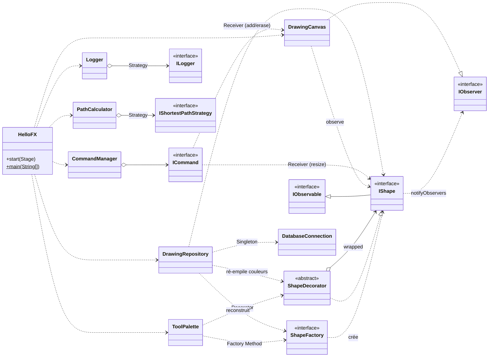
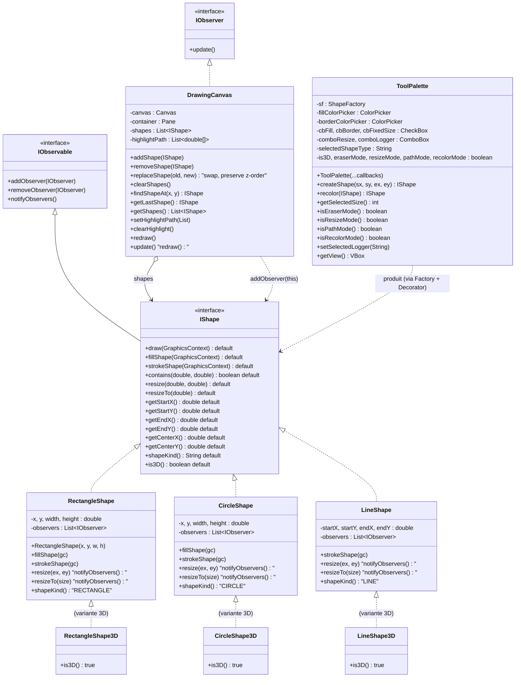
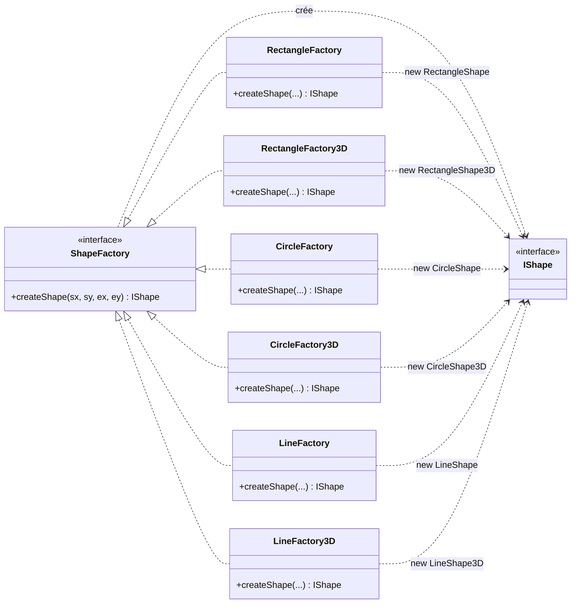
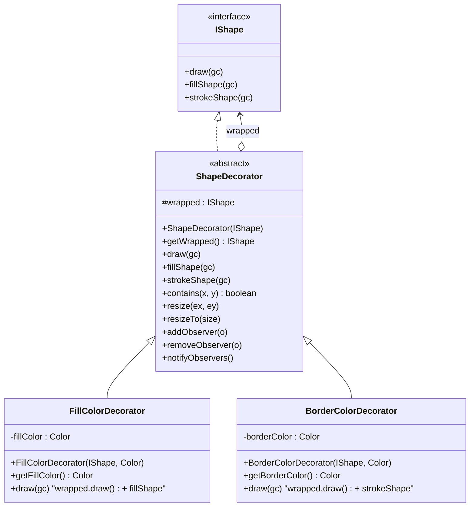
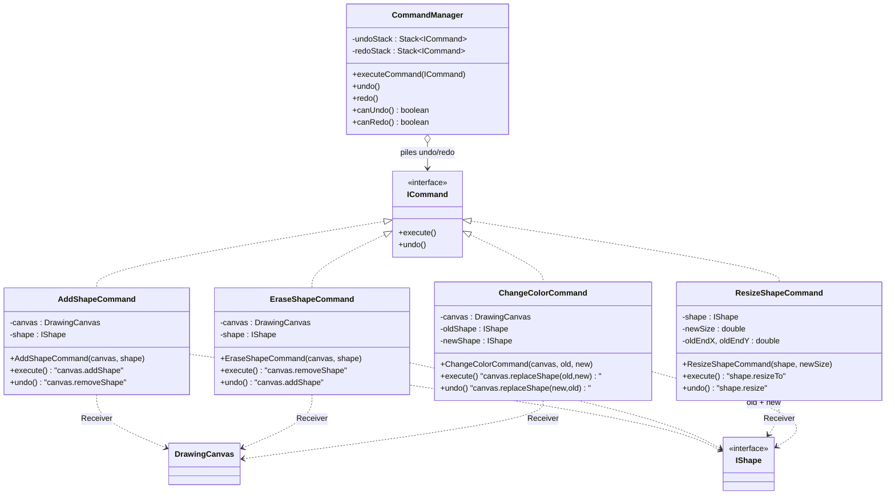
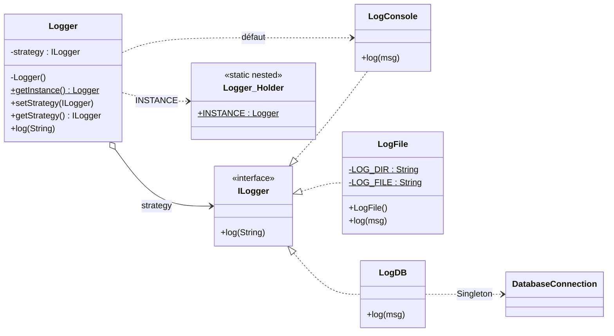
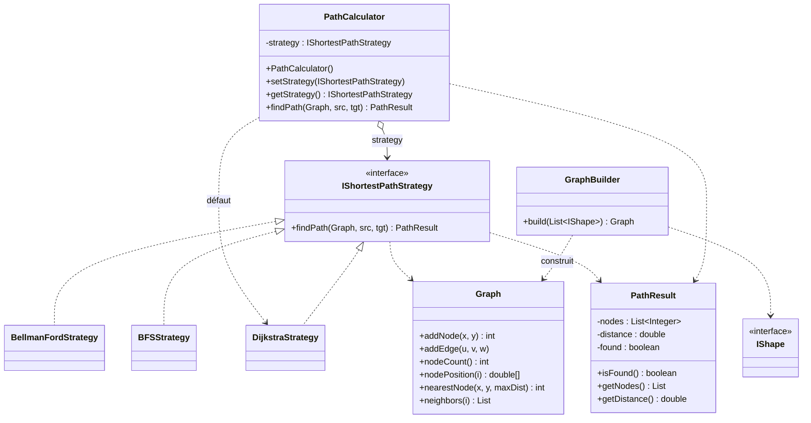
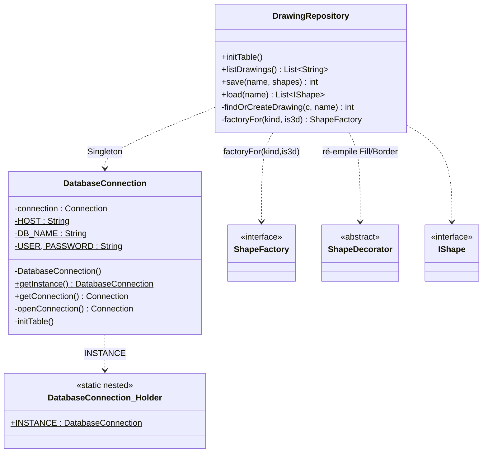
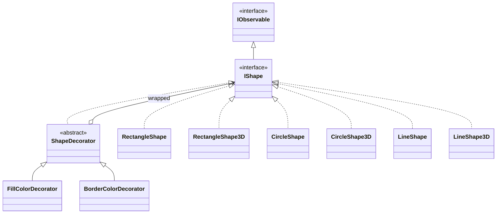
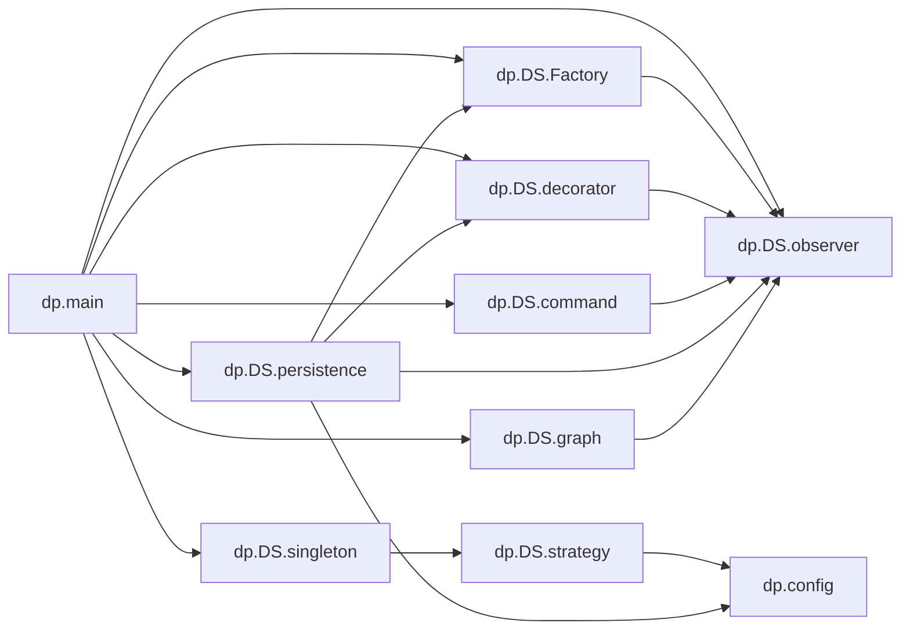

# DesignDraw — Diagramme de classes complet

> Vue exhaustive de toutes les classes du projet, regroupées par package,
> avec les attributs principaux, les méthodes publiques et les relations
> inter-classes (héritage, implémentation, composition, dépendance).
>
> Pour la justification de chaque patron, voir **`DOCUMENTATION.md`**.

---

## 1. Légende

| Notation Mermaid | Signification |
|---|---|
| `A <|.. B` | `B` implémente l'interface `A` |
| `A <|-- B` | `B` hérite de `A` (extends) |
| `A o--> B` | `A` possède `B` (composition / agrégation) |
| `A ..> B`  | `A` dépend de `B` (utilise / crée) |
| `<<interface>>` | type interface |
| `<<abstract>>`  | classe abstraite |
| `+` `-` `#` | visibilité : public / private / protected |
| `$` (suffixe) | membre `static` |

---

## 2. Diagramme global (vue d'ensemble)

---

## 3. Package `dp.DS.observer` — Observer + modèle des formes

> **Note** : les `*3D` n'héritent pas réellement de leurs équivalents 2D dans
> le code — chaque variante implémente directement `IShape`. Le diagramme
> ci-dessus regroupe visuellement par parenté logique ; pour la hiérarchie
> *exacte*, voir le diagramme **§ Hiérarchie d'implémentation** plus bas.

---

## 4. Package `dp.DS.Factory` — Factory Method

---

## 5. Package `dp.DS.decorator` — Decorator

> **Contrat** : `FillColorDecorator.draw()` et `BorderColorDecorator.draw()`
> commencent **tous deux** par `wrapped.draw(gc)` puis ajoutent leur propre
> couche (fill ou stroke). La composition est valide quel que soit l'ordre ;
> seul le z-order varie. `ShapeDecorator` délègue `addObserver` /
> `removeObserver` / `notifyObservers` à `wrapped`, donc l'Observer traverse
> les décorateurs sans qu'ils aient à gérer leur propre liste d'observateurs.

---

## 6. Package `dp.DS.command` — Command + Undo/Redo

> `ResizeShapeCommand` ne référence pas `DrawingCanvas` : il mute la forme,
> et la chaîne Observer fait redessiner le canevas (cf. **D7** dans
> `DOCUMENTATION.md`).
>
> `ChangeColorCommand` ne mute pas l'ancienne chaîne de Decorators : il en
> substitue une nouvelle (construite par `ToolPalette.recolor`) autour de
> la même forme brute. `DrawingCanvas.replaceShape` préserve la position
> dans la liste (donc le z-order) et transfère l'observateur. Voir **D12**.

---

## 7. Package `dp.DS.strategy` + `dp.DS.singleton` — Strategy + Singleton (journalisation)

---

## 8. Package `dp.DS.graph` — Strategy (plus court chemin)

---

## 9. Package `dp.config` + `dp.DS.persistence` — Singleton BD + DAO

---

## 10. Hiérarchie d'implémentation exacte des formes

Schéma fidèle au code (chaque variante 3D implémente `IShape` directement, **pas** sa cousine 2D) :

---

## 11. Carte des dépendances inter-packages

> Toutes les flèches pointent **du dépendant vers la dépendance**. Aucun
> cycle entre packages : la couche `observer` (modèle + vue) est centrale
> et ne dépend d'aucun autre package du projet ; `main` (composition root)
> est le seul à dépendre de tout le monde.

---

## 12. Carte « rôle GoF → classe du projet »

| Patron | Rôle GoF | Classe(s) du projet |
|---|---|---|
| Factory Method | Creator (interface) | `ShapeFactory` |
| Factory Method | ConcreteCreator | `RectangleFactory`, `CircleFactory`, `LineFactory` + variantes `*3D` |
| Factory Method | Product | `IShape` |
| Observer | Subject | `IObservable`, implémenté par toutes les formes (`RectangleShape`, …) |
| Observer | Observer | `IObserver`, implémenté par `DrawingCanvas` |
| Command | Command | `ICommand` |
| Command | ConcreteCommand | `AddShapeCommand`, `EraseShapeCommand`, `ResizeShapeCommand`, `ChangeColorCommand` |
| Command | Invoker | `CommandManager` |
| Command | Receiver | `DrawingCanvas` (add/erase/replace) ; `IShape` (resize) |
| Decorator | Component | `IShape` |
| Decorator | ConcreteComponent | `RectangleShape`, `CircleShape`, `LineShape` + `*3D` |
| Decorator | Decorator | `ShapeDecorator` (abstrait) |
| Decorator | ConcreteDecorator | `FillColorDecorator`, `BorderColorDecorator` |
| Strategy (logs) | Strategy | `ILogger` |
| Strategy (logs) | ConcreteStrategy | `LogConsole`, `LogFile`, `LogDB` |
| Strategy (logs) | Context | `Logger` |
| Strategy (path) | Strategy | `IShortestPathStrategy` |
| Strategy (path) | ConcreteStrategy | `DijkstraStrategy`, `BellmanFordStrategy`, `BFSStrategy` |
| Strategy (path) | Context | `PathCalculator` |
| Singleton | Singleton | `Logger`, `DatabaseConnection` (via *holder idiom*) |
| DAO / Repository | DAO | `DrawingRepository` |
