# DesignDraw — Documentation de conception

> **MASI — Mini-projet (IIT, S2 2025-2026)**
> Application JavaFX de dessin de formes (rectangle / cercle / ligne, 2D & 3D)
> illustrant les patrons de conception (*design patterns*) du GoF, plus une
> étude de cas « plus court chemin dans un graphe » et une persistance PostgreSQL.

---

## Table des matières

1. [Présentation](#1-présentation)
2. [Structure du projet](#2-structure-du-projet)
3. [Patrons de conception utilisés](#3-patrons-de-conception-utilisés)
   - [3.1 Factory Method](#31-factory-method-fabrique)
   - [3.2 Observer](#32-observer-observateur)
   - [3.3 Command (+ Undo/Redo)](#33-command-commande--undoredo)
   - [3.4 Decorator](#34-decorator-décorateur)
   - [3.5 Strategy — journalisation](#35-strategy-stratégie--journalisation)
   - [3.6 Singleton](#36-singleton)
   - [3.7 Strategy — plus court chemin](#37-strategy--plus-court-chemin-étude-de-cas)
   - [3.8 DAO / Repository — persistance](#38-dao--repository--persistance)
4. [Choix de conception (décisions)](#4-choix-de-conception-décisions)
5. [Conception UML — diagramme de classes](#5-conception-uml--diagramme-de-classes)
6. [Diagrammes de séquence](#6-diagrammes-de-séquence)
7. [Validation & remarques](#7-validation--remarques)
8. [Compilation & exécution](#8-compilation--exécution)

---

## 1. Présentation

**DesignDraw** est une application JavaFX permettant de dessiner des formes
géométriques sur un canevas. Chaque fonctionnalité est conçue pour démontrer
un patron de conception précis :

| Besoin fonctionnel | Patron démontré |
|---|---|
| Créer des formes (rectangle / cercle / ligne, 2D & 3D) | **Factory Method** |
| Redessiner le canevas quand une forme change d'état (resize) | **Observer** |
| Annuler / refaire (ajout, gomme, redimensionnement, recolorisation) | **Command** |
| Couleur de remplissage / de bordure (et bordure retirable) | **Decorator** |
| Journalisation console / fichier / base | **Strategy** + **Singleton** |
| Choisir l'algorithme du plus court chemin | **Strategy** |
| Enregistrer / ouvrir des dessins nommés | **DAO / Repository** + **Singleton** |

---

## 2. Structure du projet

```
DesignDraw/
├── src/
│   └── dp/
│       ├── main/
│       │   └── HelloFX.java                 ← point d'entrée JavaFX (assemble tout)
│       ├── config/
│       │   └── DatabaseConnection.java      ← Singleton connexion PostgreSQL
│       └── DS/
│           ├── Factory/                     ← Factory Method
│           │   ├── ShapeFactory.java        ← interface Creator
│           │   ├── RectangleFactory.java / RectangleFactory3D.java
│           │   ├── CircleFactory.java    / CircleFactory3D.java
│           │   └── LineFactory.java      / LineFactory3D.java
│           ├── observer/                    ← Observer + formes + UI
│           │   ├── IObservable.java / IObserver.java
│           │   ├── IShape.java              ← contrat de forme (Subject)
│           │   ├── RectangleShape.java / RectangleShape3D.java
│           │   ├── CircleShape.java    / CircleShape3D.java
│           │   ├── LineShape.java      / LineShape3D.java
│           │   ├── DrawingCanvas.java       ← Observer concret
│           │   └── ToolPalette.java         ← barre d'outils (contrôleur, callbacks)
│           ├── command/                     ← Command
│           │   ├── ICommand.java
│           │   ├── CommandManager.java      ← invoker (piles undo/redo)
│           │   ├── AddShapeCommand.java
│           │   ├── EraseShapeCommand.java
│           │   ├── ResizeShapeCommand.java
│           │   └── ChangeColorCommand.java  ← recolorisation / bordure on-off
│           ├── decorator/                   ← Decorator
│           │   ├── ShapeDecorator.java      ← décorateur abstrait
│           │   ├── FillColorDecorator.java
│           │   └── BorderColorDecorator.java
│           ├── strategy/                    ← Strategy (journalisation)
│           │   ├── ILogger.java
│           │   ├── LogConsole.java
│           │   ├── LogFile.java
│           │   └── LogDB.java
│           ├── singleton/
│           │   └── Logger.java              ← Singleton + contexte Strategy
│           ├── graph/                       ← Strategy (plus court chemin)
│           │   ├── IShortestPathStrategy.java
│           │   ├── PathCalculator.java      ← contexte
│           │   ├── DijkstraStrategy.java
│           │   ├── BellmanFordStrategy.java
│           │   ├── BFSStrategy.java
│           │   ├── Graph.java / GraphBuilder.java / PathResult.java
│           └── persistence/
│               └── DrawingRepository.java   ← DAO (dessins nommés)
├── lib/postgresql-42.7.3.jar                ← pilote JDBC PostgreSQL
└── logs/application.log                     ← sortie de LogFile
```

**Lecture transversale** : la classe `HelloFX` est le *composition root* : elle
instancie le `CommandManager`, le `Logger` (Singleton), le `PathCalculator`, le
`DrawingRepository`, le `DrawingCanvas` et la `ToolPalette`, et câble les
*callbacks* de la palette vers les commandes / stratégies / DAO.

---

## 3. Patrons de conception utilisés

Pour chaque patron : **ce qu'il fait**, **pourquoi ce choix ici**, **classes
impliquées** et un **diagramme**.

### 3.1 Factory Method (Fabrique)

**Ce qu'il fait** — Délègue la création des objets `IShape` à des fabriques
spécialisées. Le code client (`ToolPalette`) ne fait jamais `new RectangleShape(...)` ;
il demande à une `ShapeFactory` de produire la forme.

**Pourquoi ici** — On a 6 produits (Rectangle / Cercle / Ligne × 2D / 3D). La
fabrique encapsule le calcul de la boîte englobante (normalisation
`min/abs` des coordonnées) et isole le client des classes concrètes : ajouter
un nouveau type de forme = ajouter une fabrique, sans toucher au reste.

**Classes** — `ShapeFactory` (Creator), `RectangleFactory`, `CircleFactory`,
`LineFactory` et leurs variantes `*3D` (ConcreteCreators), `IShape` (Product).

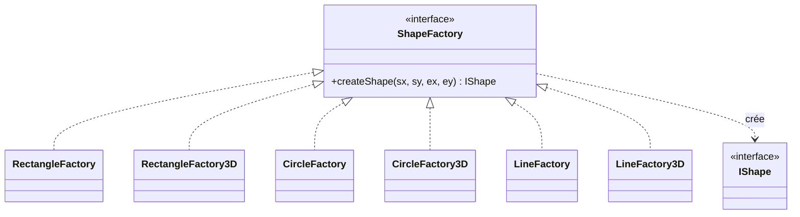

> **Remarque de validation** : la sélection de la fabrique concrète se fait
> dans `ToolPalette.updateFactory()` selon le type choisi et le bouton 2D/3D.
> C'est donc un Factory Method « paramétré » (proche d'une *Simple Factory*),
> mais chaque ConcreteCreator redéfinit bien la méthode-fabrique `createShape` :
> la démonstration du patron reste valide.

---

### 3.2 Observer (Observateur)

**Ce qu'il fait** — Découple un objet qui change d'état (le **modèle**) des
vues qui doivent réagir. Une forme qui se redimensionne notifie ses
observateurs ; le `DrawingCanvas` se redessine sans que la forme ait à
le connaître.

**Pourquoi ici** — Le rôle de chaque acteur de l'application correspond
exactement aux rôles GoF :

| Rôle MVC | Classe | Rôle Observer |
|---|---|---|
| Modèle (état) | `IShape` et ses concrètes | **Subject** (Observable) |
| Vue (rendu) | `DrawingCanvas` | **Observer** (passif, redessine) |
| Contrôleur (entrées) | `ToolPalette`, `HelloFX` | ni l'un ni l'autre — émet des callbacks |

L'Observer évite un couplage fort modèle→vue et permet d'ajouter d'autres
observateurs (p. ex. un mini-aperçu, un panneau de propriétés) sans
modifier les formes.

**Mécanique concrète** — Chaque mutateur de forme (`resize`, `resizeTo`)
appelle `notifyObservers()` après avoir modifié sa géométrie. Le canevas
s'abonne lorsqu'une forme est ajoutée (`canvas.addShape(s)` → `s.addObserver(this)`)
et se désabonne à la suppression. Sa méthode `update()` se contente d'appeler
`redraw()`.

**Note importante — `ToolPalette` n'est PAS Observable.** La palette est un
contrôleur : cliquer un bouton n'altère aucun pixel du canevas, donc il n'y a
rien à « observer » côté palette. Ses événements (« outil Rectangle choisi »,
« nouvelle stratégie de log ») sont publiés via les `Runnable` / `Consumer`
passés à son constructeur — c'est plus précis sémantiquement (`onRectangle`,
`onLoggerChange`) que l'`update()` générique d'Observer. Faire de la palette
un Subject reviendrait à dupliquer ce canal et provoquerait un `redraw()`
inutile à chaque clic d'outil.

**Décorateurs et Observer** — `ShapeDecorator` délègue
`addObserver` / `removeObserver` / `notifyObservers` à `wrapped`. Quand le
canevas s'abonne à une forme décorée (`shape.addObserver(this)`), l'observateur
se retrouve enregistré sur la **forme interne** ; quand la forme interne
notifie, le canevas est appelé. La chaîne fonctionne de bout en bout sans que
les décorateurs aient à connaître la liste d'observateurs.

**Classes** — `IObservable` (Subject), `IObserver` (Observer), toutes les
formes `IShape` sont *observables* ; `DrawingCanvas` est l'*observateur*
concret (`update()` → `redraw()`).

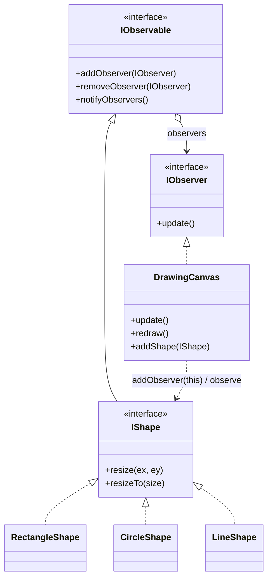

---

### 3.3 Command (Commande) + Undo/Redo

**Ce qu'il fait** — Encapsule chaque action utilisateur (dessiner, gommer,
redimensionner, recolorier) dans un objet `ICommand` possédant `execute()` et
`undo()`. Le `CommandManager` empile les commandes exécutées (pile *undo*) et
les commandes annulées (pile *redo*).

**Pourquoi ici** — C'est le patron canonique pour un Undo/Redo robuste : chaque
commande sait défaire son propre effet et capture l'état nécessaire à
l'annulation (ex. `ResizeShapeCommand` mémorise l'extrémité précédente ;
`ChangeColorCommand` mémorise l'ancien empilement de décorateurs).

**Receivers** — `AddShapeCommand` et `EraseShapeCommand` ont pour Receiver
le `DrawingCanvas` (ils ajoutent/retirent la forme du modèle). En revanche
`ResizeShapeCommand` a pour Receiver la **forme elle-même** : il modifie sa
géométrie ; le canevas se redessine ensuite via Observer (cf. §3.2). La
commande de redimensionnement ne dépend donc plus du canevas — couplage
strictement minimal. `ChangeColorCommand` a pour Receiver le `DrawingCanvas`
(via `replaceShape(old, new)`), mais ne mute pas l'ancienne chaîne de
Decorators : il en **substitue** une nouvelle (construite par
`ToolPalette.recolor` autour de la même forme brute). Voir §3.4 et §D12.

**Classes** — `ICommand`, `CommandManager` (Invoker), `AddShapeCommand`,
`EraseShapeCommand`, `ResizeShapeCommand`, `ChangeColorCommand` ;
*Receivers* : `DrawingCanvas` (add / erase / replace) et `IShape` (resize).

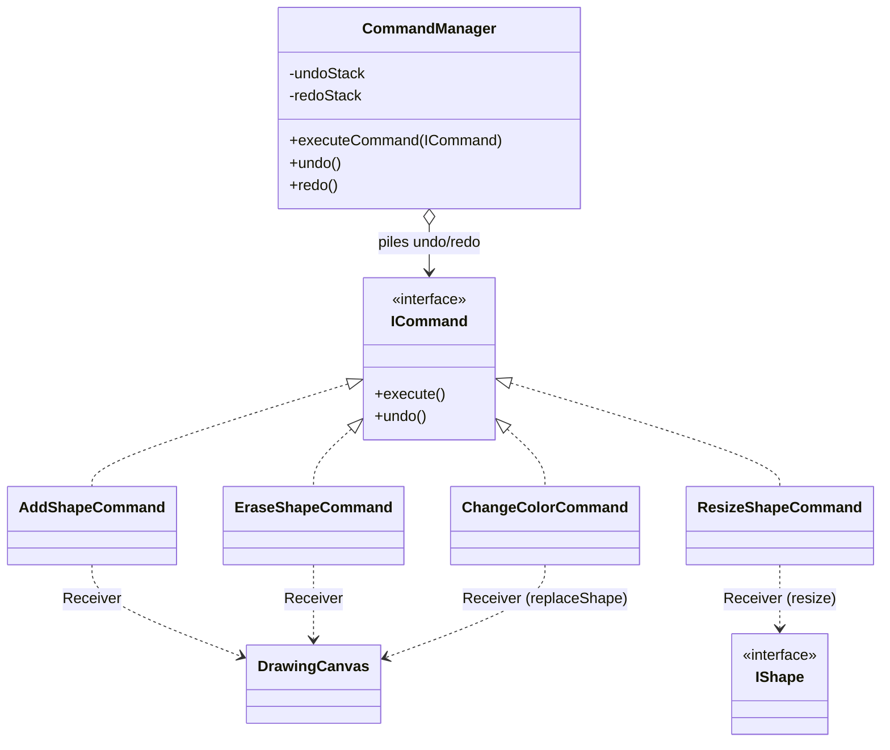

---

### 3.4 Decorator (Décorateur)

**Ce qu'il fait** — Ajoute dynamiquement des responsabilités visuelles à une
forme sans modifier sa classe : remplissage (`FillColorDecorator`) et contour
(`BorderColorDecorator`). Les décorateurs s'empilent
(`BorderColorDecorator(FillColorDecorator(shape))`).

**Pourquoi ici** — Les combinaisons (remplir / border / les deux / aucun) sont
nombreuses ; une hiérarchie d'héritage exploserait. Le Decorator compose les
effets à l'exécution selon les cases cochées dans la palette.

**Contrat de rendu (refactorisé — voir §4)** :
- `IShape.draw()` ne dessine **rien** par défaut.
- Chaque forme concrète implémente `fillShape()` (intérieur) et
  `strokeShape()` (contour) — jamais `draw()` directement.
- **Chaque décorateur appelle d'abord `wrapped.draw(gc)`** (les couches
  internes se peignent), puis ajoute sa propre contribution par-dessus :
  - `FillColorDecorator.draw()` = `wrapped.draw()` **puis** `wrapped.fillShape()`
    en couleur de remplissage ;
  - `BorderColorDecorator.draw()` = `wrapped.draw()` **puis**
    `wrapped.strokeShape()` en couleur de bordure.

C'est le contrat **canonique** du Decorator : la composition est valide
quel que soit l'ordre d'empilement ; seul le **z-order** dépend de l'ordre
(le décorateur externe peint au-dessus). En pratique `ToolPalette` empile
toujours `Border(Fill(forme))` pour que le contour apparaisse au-dessus
du remplissage, mais le code resterait correct si on inversait.

**Conséquence assumée** — une forme sans aucun décorateur ne dessine rien
(c'est le but : décocher *Bordure* + *Remplir* rend la forme invisible).
Les lignes n'ont pas d'intérieur ; `ToolPalette` les enveloppe toujours
d'un `BorderColorDecorator` dont la couleur vient du sélecteur principal.

**Recoloration d'une forme existante (cf. §3.3 et §D12)** — `ToolPalette.recolor(IShape)`
déballe la chaîne (`while (cur instanceof ShapeDecorator) cur = cur.getWrapped()`)
pour retrouver la forme brute, puis en **construit une nouvelle chaîne** selon
l'état courant de la palette (`cbFill`, `cbBorder`, les deux `ColorPicker`s).
Décocher *Bordure* produit littéralement une chaîne sans
`BorderColorDecorator` — le contour disparaît. `ChangeColorCommand`
substitue cette nouvelle chaîne à l'ancienne dans le canevas via
`DrawingCanvas.replaceShape`. Reconstruire (plutôt que muter) la chaîne
permet **à la fois** de changer une couleur **et** de retirer/remettre la
bordure, et préserve l'immutabilité des Decorators.

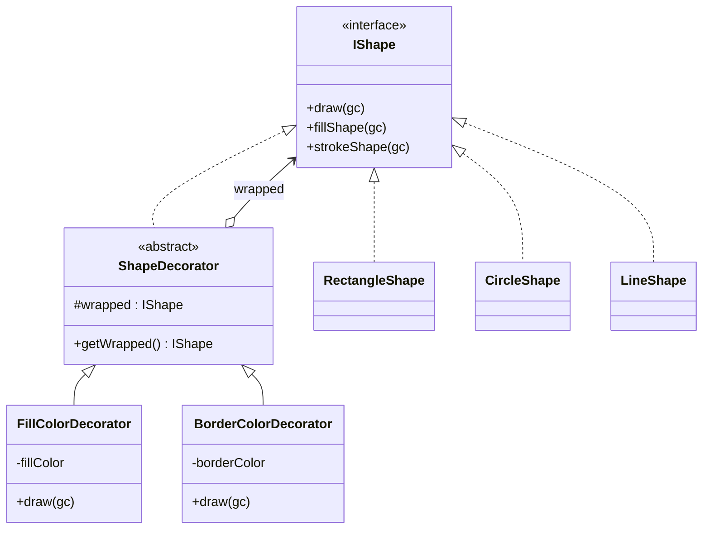

---

### 3.5 Strategy (Stratégie) — journalisation

**Ce qu'il fait** — Rend l'algorithme de journalisation interchangeable à
l'exécution : console (`LogConsole`), fichier (`LogFile`) ou base
(`LogDB`). Le contexte `Logger` délègue à la stratégie courante.

**Pourquoi ici** — La destination des logs est une variation pure de
comportement ; Strategy permet de la changer via un `ComboBox` sans
conditionnelle `if/switch` disséminée dans le code.

**Classes** — `ILogger` (Strategy), `LogConsole` / `LogFile` / `LogDB`
(ConcreteStrategies), `Logger` (Context, voir §3.6).

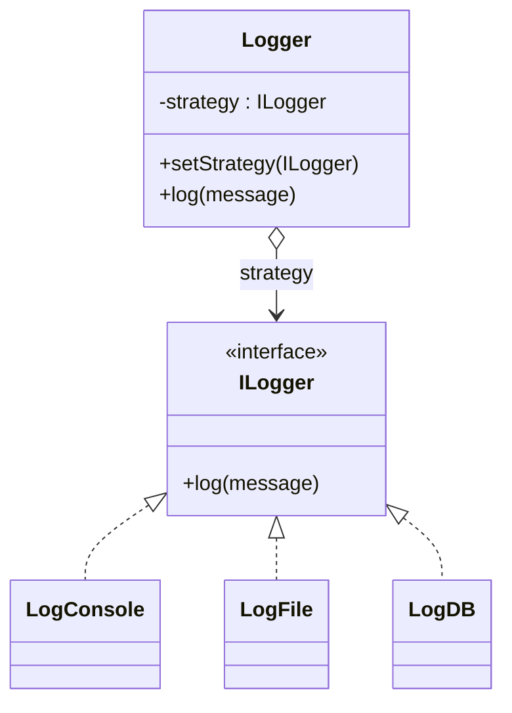

---

### 3.6 Singleton

**Ce qu'il fait** — Garantit une instance unique partagée.
- `Logger` : un seul journal pour toute l'application (et porte la Strategy de §3.5).
- `DatabaseConnection` : une seule connexion JDBC partagée par `LogDB` **et**
  `DrawingRepository`.

**Pourquoi ici** — Le journal et la connexion BD sont des ressources globales :
on veut un point d'accès unique, une configuration centralisée, et éviter
d'ouvrir plusieurs connexions PostgreSQL.

**Implémentation — *holder idiom*** — Les deux Singletons utilisent une
classe interne `Holder` qui détient l'instance dans un champ
`static final`. Le JVM garantit qu'une classe n'est initialisée qu'**une
seule fois** et que cette initialisation est **thread-safe** ; on obtient
donc un Singleton **lazy** (le `Holder` n'est chargé qu'au premier appel
à `getInstance()`) **ET** correct en multi-threading, sans `synchronized`
ni `volatile`.

```java
public class Logger {
    private Logger() { this.strategy = new LogConsole(); }

    private static class Holder {
        private static final Logger INSTANCE = new Logger();
    }

    public static Logger getInstance() { return Holder.INSTANCE; }
}
```

> **Pourquoi pas `if (instance == null) instance = new Logger();` ?**
> Sans `synchronized`/`volatile`, deux threads peuvent franchir le test et
> créer deux instances — ce qui **viole la propriété même** que le Singleton
> doit garantir. Pour `DatabaseConnection`, cela ouvrirait également deux
> connexions JDBC dont une serait orpheline. Le *holder idiom* élimine
> cette fenêtre de course sans coût d'exécution.

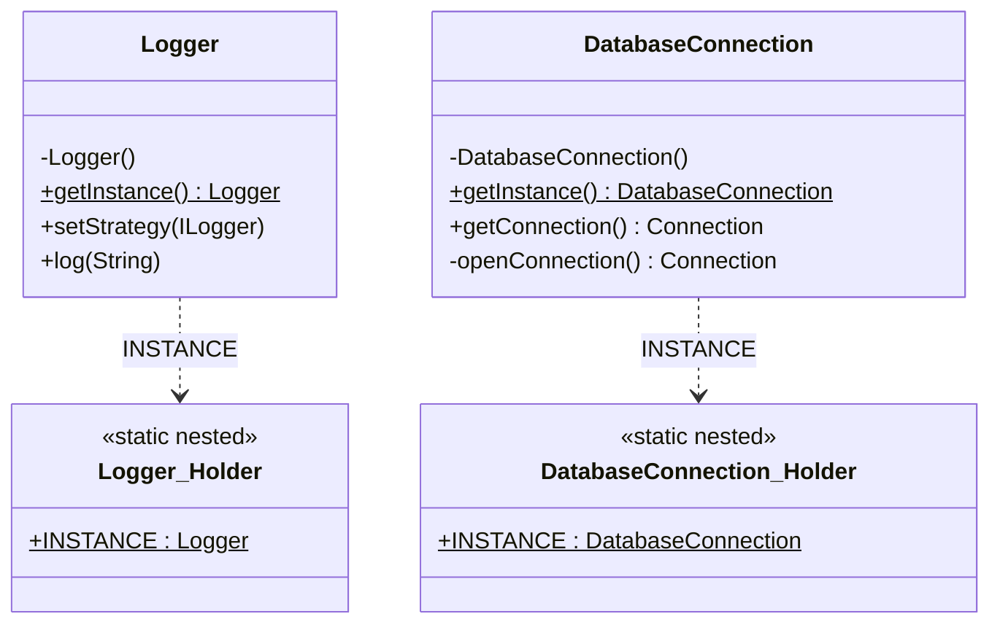

---

### 3.7 Strategy — plus court chemin (étude de cas)

**Ce qu'il fait** — Même patron que la journalisation, appliqué au calcul du
plus court chemin : `Dijkstra`, `Bellman-Ford` ou `BFS`, choisis dans un
`ComboBox`. Le contexte `PathCalculator` délègue à la stratégie courante.

**Modèle de graphe** — `GraphBuilder` transforme les formes en `Graph` :
toute forme **non-ligne** = un nœud (sur son centre), chaque **ligne** = une
arête (poids = distance euclidienne). *Repli* : si aucune ligne ne crée
d'arête, le graphe est rendu **complet** afin qu'une distance soit toujours
calculable.

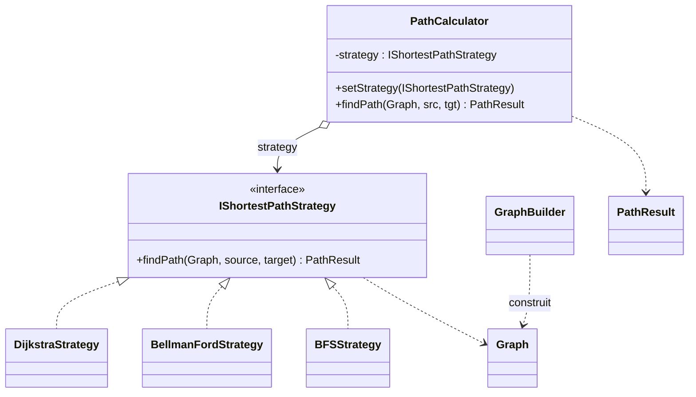

---

### 3.8 DAO / Repository — persistance

**Ce qu'il fait** — `DrawingRepository` est un *Data Access Object* : il
isole la logique SQL (PostgreSQL) du reste de l'application. Il gère
**plusieurs dessins nommés** :

- `listDrawings()` — noms des dessins enregistrés ;
- `save(nom, formes)` — crée/écrase le dessin nommé (transaction) ;
- `load(nom)` — reconstruit les formes via **Factory** + **Decorator**.

**Pourquoi ici** — Centraliser l'accès aux données, garder le SQL hors de
l'IHM, et illustrer la collaboration entre patrons : la reconstruction d'un
dessin réutilise les fabriques et ré-empile les décorateurs de couleur.

**Schéma** : `drawings(id, name UNIQUE, created_at)` et
`shapes(id, drawing_id, kind, is3d, x1,y1,x2,y2, fill_color, border_color)`.

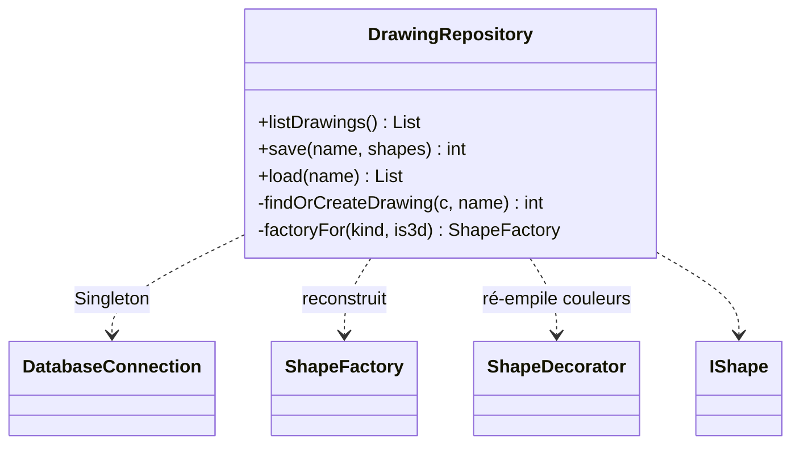

---

## 4. Choix de conception (décisions)

Décisions structurantes prises (ou confirmées) au cours du développement, avec
leur justification.

### D1 — Redimensionnement = Command, **pas** Decorator
Le redimensionnement est une **action annulable** → c'est exactement le rôle du
patron **Command** (`ResizeShapeCommand`, intégré aux piles undo/redo). Un
`ResizeDecorator` aurait été sémantiquement faux (un Decorator *ajoute une
responsabilité visuelle*, il ne *mute pas la géométrie*) et aurait cassé : (a)
l'undo/redo, (b) le parcours de chaîne de décorateurs de la persistance
(`findFill`/`findBorder`), (c) la composition (empiler deux resize n'a pas de
sens). **Décision : conserver Command.**

### D2 — Refactorisation du contrat de rendu Decorator
*Problème initial* : chaque forme dessinait elle-même son contour dans `draw()`,
et `DrawingCanvas` posait un trait noir par défaut. Décocher « Bordure » ne
supprimait donc pas le contour (il restait, en noir).
*Solution* : `IShape.draw()` devient **no-op** par défaut ; on sépare
`fillShape()` (intérieur) et `strokeShape()` (contour). `FillColorDecorator`
ne fait que remplir, `BorderColorDecorator` ne fait que tracer le contour.
*Conséquence assumée* : une forme **sans remplissage ni bordure est invisible**
(c'est l'absence volontaire de tout rendu). C'est le modèle Decorator *correct*.

### D3 — Persistance multi-dessins
Passage d'un dessin unique global à des **dessins nommés** (tables `drawings` +
`shapes`, FK logique `drawing_id`). Migration douce d'une ancienne base via
`ALTER TABLE shapes ADD COLUMN IF NOT EXISTS drawing_id`. IHM : `TextInputDialog`
(nom à l'enregistrement, un nom existant écrase) et `ChoiceDialog` (sélection à
l'ouverture). `ToolPalette` inchangée (callbacks `Runnable`, la logique des
boîtes de dialogue vit dans `HelloFX`).

### D4 — Auto-création de la base
La connexion échouait car la base `logdb` n'existait pas (SQLState `3D000`).
`DatabaseConnection.openConnection()` détecte ce cas, se connecte à la base de
maintenance `postgres`, exécute `CREATE DATABASE logdb`, puis se reconnecte.
Identifiants : `postgres` / `admin` (en clair — acceptable pour un projet
pédagogique, à signaler).

### D5 — Couleur de ligne et bordure non forcée
Une ligne n'a pas d'intérieur : sa **couleur = le sélecteur principal
« Couleur »** (et non l'ancien sélecteur de bordure). La bordure des formes
fermées n'est appliquée **que si la case « Bordure » est cochée** (suppression
du `|| isLine` qui la forçait).

### D6 — IHM réorganisée (visuel uniquement)
Barre d'outils regroupée en sections étiquetées compactes (`FlowPane`), boutons
stylés avec survol (accent primaire pour *Plus court chemin / Enregistrer /
Ouvrir*), fond du canevas **blanc** (au lieu de jaune). Aucune logique, aucun
*callback*, aucune API publique modifiés.

### D7 — Observer rendu fonctionnel (était présent mais inerte)
*Problème détecté à l'audit* : les six classes de forme implémentaient
`addObserver` / `removeObserver` / `notifyObservers`, et `DrawingCanvas`
s'abonnait à chaque forme via `shape.addObserver(this)` — mais
**aucun mutateur de forme n'appelait `notifyObservers()`**. Tous les
redraws étaient déclenchés directement par les commandes
(`canvas.redraw()` dans `ResizeShapeCommand.execute()/undo()`), ce qui
court-circuitait totalement la chaîne Observer.
*Correctif* :
- `resize(...)` et `resizeTo(...)` des six formes (2D + 3D) appellent
  `notifyObservers()` après modification de l'état ;
- les `canvas.redraw()` explicites de `ResizeShapeCommand` sont supprimés ;
- `ResizeShapeCommand` n'a plus de référence au `DrawingCanvas` du tout
  (le champ et le paramètre de constructeur ont été retirés).
Conséquence : le patron Observer porte enfin réellement la mise à jour
modèle→vue, et la commande n'est plus couplée à la vue.

### D8 — `ToolPalette` n'est plus *Observable*
*Problème détecté à l'audit* : `ToolPalette` implémentait `IObservable` et
notifiait à chaque clic d'outil ; seul `DrawingCanvas` était abonné, et
son `update()` provoquait un `redraw()` alors qu'**aucun pixel n'avait
changé** (sélectionner un outil ne modifie aucune forme). C'était un
second canal de notification redondant avec les `Runnable` du constructeur
de la palette, et un détournement du patron : la palette est un
**contrôleur**, pas un modèle.
*Correctif* : suppression de `implements IObservable`, du champ
`observers` et des trois méthodes Observer dans `ToolPalette` ; suppression
de `palette.addObserver(drawingCanvas)` dans `HelloFX`. Les événements
de la palette continuent de passer par les `Runnable` / `Consumer` typés
du constructeur — canal plus précis sémantiquement.

### D9 — Decorator rendu compositionnel (bug d'ordre corrigé)
*Problème détecté à l'audit* : `FillColorDecorator.draw()` n'appelait pas
`wrapped.draw(gc)` avant de peindre son remplissage. Conséquence : la
chaîne `Fill(Border(forme))` perdait silencieusement le contour
(le `draw()` du `BorderColorDecorator` n'était jamais invoqué). Le code
« marchait » parce que `ToolPalette` empile toujours `Border` à
l'extérieur — invariant maintenu par un unique site d'appel, fragile.
*Correctif* : `FillColorDecorator.draw()` commence désormais par
`wrapped.draw(gc);`, comme `BorderColorDecorator` le faisait déjà. Tout
empilement compose désormais correctement ; seul le z-order dépend de
l'ordre, ce qui est précisément le rôle du Decorator.

### D10 — Singletons thread-safe (*holder idiom*)
*Problème détecté à l'audit* : `Logger.getInstance()` et
`DatabaseConnection.getInstance()` utilisaient l'anti-pattern classique
`if (instance == null) instance = new X()` — sans `synchronized` ni
`volatile`, deux threads peuvent créer deux instances, ce qui viole la
propriété fondamentale du Singleton (et ouvrirait deux connexions JDBC
dans le cas de `DatabaseConnection`).
*Correctif* : les deux Singletons utilisent désormais une classe interne
`Holder` portant un champ `static final INSTANCE`. Le JVM garantit
classe-init atomique, donc le Singleton est **lazy + thread-safe** sans
synchronisation explicite. Voir §3.6.

### D11 — Suppression de l'interface `Shape` vide (code mort)
Le fichier `dp/DS/observer/Shape.java` ne contenait que
`public interface Shape { }` — vestige d'un refactor antérieur, jamais
importé ni implémenté ailleurs. Supprimé.

### D12 — Recolorisation = Command (substitution de chaîne), pas mutation de Decorator
*Besoin* : changer la couleur de remplissage / la couleur de bordure d'une
forme déjà dessinée, **et** pouvoir retirer la bordure (ou la remettre).
*Options examinées* :
- **Muter** le champ `fillColor` / `borderColor` du Decorator existant —
  cassant : les Decorators sont volontairement immuables (champs `final`),
  et surtout cela ne traite pas le cas « retirer la bordure » (changement
  *structurel* de la chaîne, pas seulement de valeur).
- **Memento** — capturerait l'état pour l'undo, mais les couleurs ne sont
  pas un état privé : elles **sont** la chaîne de Decorators publique. Un
  Memento dupliquerait inutilement ce que la chaîne porte déjà.
- **Command** (retenu) — chaque recoloration est une action discrète,
  réversible, qui s'inscrit naturellement dans les piles undo/redo du
  `CommandManager` aux côtés de `Add`/`Erase`/`Resize`.

*Décision* : nouveau `ChangeColorCommand` ; nouvelle méthode
`DrawingCanvas.replaceShape(old, new)` (préserve la position dans la liste
— donc le z-order — et transfère l'observateur) ; nouvelle méthode
`ToolPalette.recolor(IShape)` qui déballe la chaîne pour récupérer la forme
brute et en construit une nouvelle selon l'état courant de la palette
(mêmes règles que `createShape`). Nouveau bouton « Recolorer » dans la
section *Édition* + flag `recolorMode` (même style que `eraserMode` /
`resizeMode` / `pathMode`). La même forme brute est partagée entre l'ancienne
et la nouvelle chaîne, donc l'identité logique de la forme et ses
observateurs sont préservés.

---

## 5. Conception UML — diagramme de classes

Vue d'ensemble (simplifiée — relations principales entre patrons) :

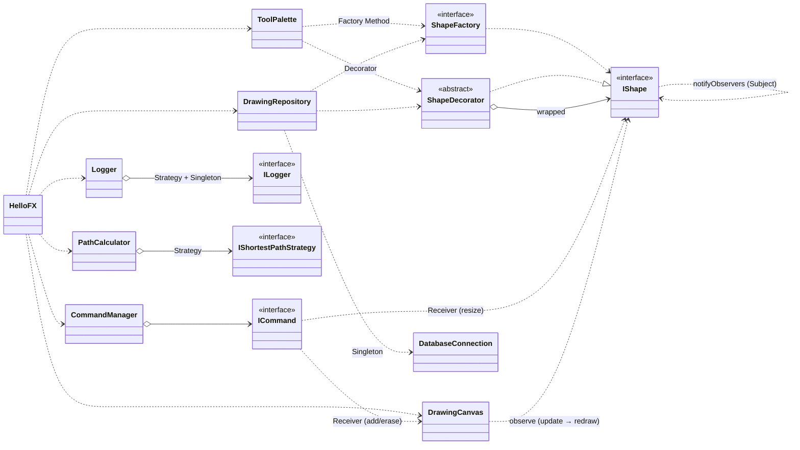

Les diagrammes détaillés par patron figurent en §3.

---

## 6. Diagrammes de séquence

### 6.1 Dessiner une forme (Factory + Decorator + Command)

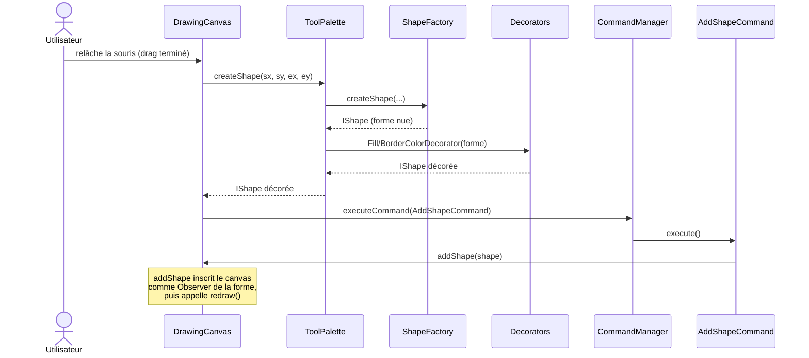

### 6.1bis Redimensionner une forme (Command + Observer)

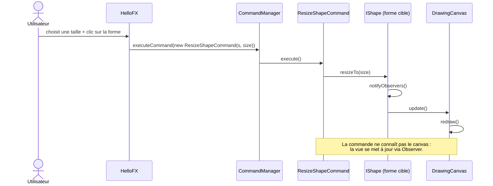

### 6.1ter Recolorer une forme existante (Command + Decorator)

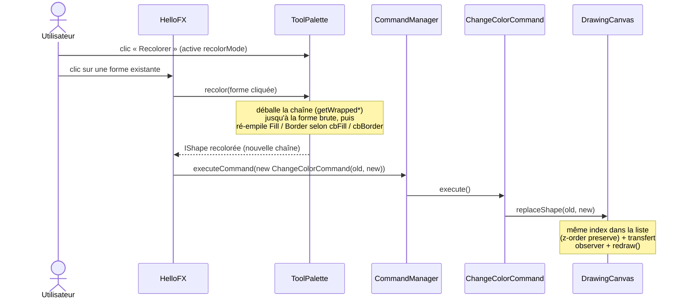

### 6.2 Changer la stratégie de journalisation (Strategy + Singleton)

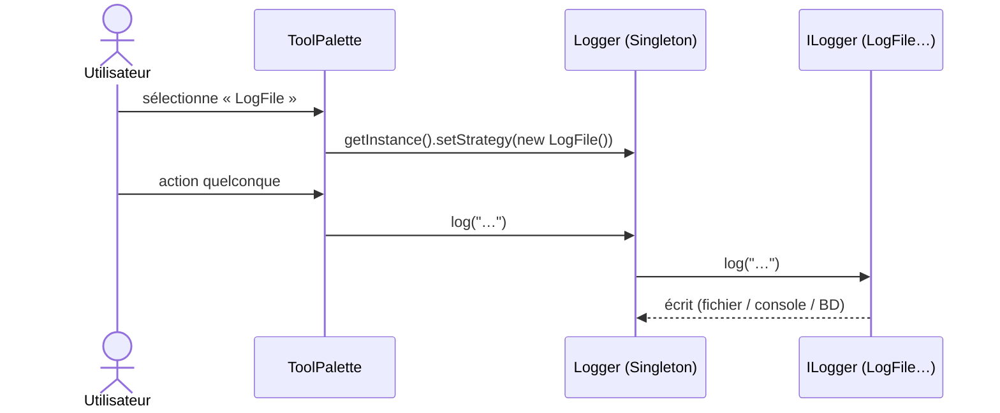

### 6.3 Calcul du plus court chemin (Strategy)

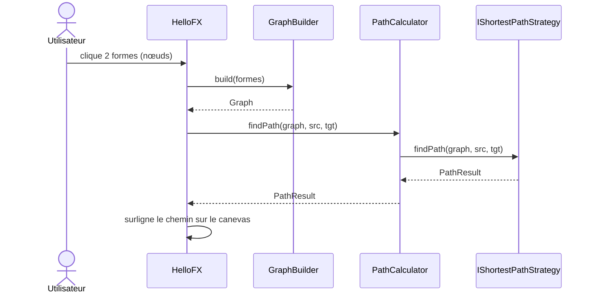

---

## 7. Validation & remarques

**Patrons — conformité** : les 6 patrons GoF requis (Factory Method, Observer,
Command, Decorator, Strategy, Singleton) sont présents, correctement structurés
et réellement utilisés par l'IHM. Un audit ciblé a corrigé les cas où un patron
était déclaré mais ne portait pas son comportement (D7, D8, D9, D10 — cf. §4) :
chaque patron remplit désormais effectivement sa fonction au runtime, et plus
seulement « structurellement ». L'étude de cas (plus court chemin) réutilise
Strategy de façon cohérente avec la journalisation. La persistance illustre la
collaboration Factory + Decorator + Singleton.

**Résumé de l'audit** :

| Patron | Avant audit | Après audit |
|---|---|---|
| Factory Method | ✅ | ✅ |
| Command | ✅ | ✅ (Resize découplé du canvas, voir D7 ; + `ChangeColorCommand`, D12) |
| Observer | ⚠ formes câblées mais ne notifiaient jamais ; ToolPalette à tort *Subject* | ✅ D7 + D8 |
| Decorator | ⚠ `FillColorDecorator` n'appelait pas `wrapped.draw()` → ordre fragile | ✅ D9 (+ recolor par substitution de chaîne, D12) |
| Strategy | ✅ | ✅ |
| Singleton | ⚠ init paresseuse non thread-safe | ✅ holder idiom (D10) |
| Code mort | ⚠ interface `Shape` vide | ✅ supprimée (D11) |

**Points d'amélioration relevés (non bloquants)** :

1. Le package **`dp.DS.Factory`** a une majuscule, contrairement à la
   convention Java (packages en minuscules) et aux autres packages du projet.
2. Le package `observer` regroupe beaucoup de responsabilités (formes,
   canevas, palette, interfaces Observer). Cohésion perfectible — on pourrait
   séparer `shape` / `ui` / `observer` — mais acceptable pour le périmètre.
3. Identifiants PostgreSQL **en clair** dans `DatabaseConnection` (projet
   pédagogique — à externaliser dans une vraie application).
4. Commentaire de `Graph` légèrement obsolète (« chaque cercle = un nœud »
   alors que `GraphBuilder` prend toute forme non-ligne).
5. La couleur d'une ligne est stockée dans la colonne `border_color` (détail
   d'implémentation : visuellement correct car la ligne est un *stroke*).

**Conclusion** : structure saine, patrons bien démontrés et justifiés ; les
remarques ci-dessus sont des finitions, pas des défauts de conception.
Un diagramme de classes complet (toutes les classes du projet, toutes les
relations) est fourni séparément dans **`CLASS_DIAGRAM.md`**.

---

## 8. Compilation & exécution

**Prérequis** : JDK 17, JavaFX SDK 21 (`C:\javafx-sdk-21.0.10\lib`),
PostgreSQL en écoute sur `localhost:5432` (utilisateur `postgres`, mot de
passe `admin` — la base `logdb` est créée automatiquement si absente),
pilote `lib\postgresql-42.7.3.jar`.

**Compilation** (sans Maven/Gradle) :

```bat
javac -d out --module-path C:\javafx-sdk-21.0.10\lib ^
  --add-modules javafx.controls,javafx.graphics,javafx.base ^
  -cp lib\postgresql-42.7.3.jar <tous les .java de src>
```

**Exécution** (utiliser le **java de JDK 17**, pas un éventuel Java 8 du PATH) :

```bat
"C:\Program Files\Java\jdk-17\bin\java.exe" ^
  --module-path C:\javafx-sdk-21.0.10\lib ^
  --add-modules javafx.controls,javafx.fxml ^
  -cp "out;lib\postgresql-42.7.3.jar" dp.main.HelloFX
```

Sous IntelliJ, le pilote PostgreSQL est déclaré comme dépendance de module
dans `miniprojet.iml` ; en cas d'erreur « Driver PostgreSQL introuvable »,
recharger le projet (*Reload All from Disk*).
