# DesignDraw — Documentation de conception

> **MASI — Mini-projet (IIT, S2 2025-2026)**
> Application JavaFX de dessin de formes (rectangle / cercle / ligne, 2D & 3D)
> illustrant les patrons de conception (*design patterns*) du GoF, plus une
> étude de cas « plus court chemin dans un graphe » et une persistance PostgreSQL.

---

## Table des matières

1. [Présentation](#1-présentation)
2. [Structure du projet](#2-structure-du-projet)
3. [Patrons de conception utilisés](#3-patrons-de-conception-utilisés)
   - [3.1 Factory Method](#31-factory-method-fabrique)
   - [3.2 Observer](#32-observer-observateur)
   - [3.3 Command (+ Undo/Redo)](#33-command-commande--undoredo)
   - [3.4 Decorator](#34-decorator-décorateur)
   - [3.5 Strategy — journalisation](#35-strategy-stratégie--journalisation)
   - [3.6 Singleton](#36-singleton)
   - [3.7 Strategy — plus court chemin](#37-strategy--plus-court-chemin-étude-de-cas)
   - [3.8 DAO / Repository — persistance](#38-dao--repository--persistance)
4. [Choix de conception (décisions)](#4-choix-de-conception-décisions)
5. [Conception UML — diagramme de classes](#5-conception-uml--diagramme-de-classes)
6. [Diagrammes de séquence](#6-diagrammes-de-séquence)
7. [Validation & remarques](#7-validation--remarques)
8. [Compilation & exécution](#8-compilation--exécution)

---

## 1. Présentation

**DesignDraw** est une application JavaFX permettant de dessiner des formes
géométriques sur un canevas. Chaque fonctionnalité est conçue pour démontrer
un patron de conception précis :

| Besoin fonctionnel | Patron démontré |
|---|---|
| Créer des formes (rectangle / cercle / ligne, 2D & 3D) | **Factory Method** |
| Redessiner le canevas quand l'outil change | **Observer** |
| Annuler / refaire (ajout, gomme, redimensionnement) | **Command** |
| Couleur de remplissage / de bordure | **Decorator** |
| Journalisation console / fichier / base | **Strategy** + **Singleton** |
| Choisir l'algorithme du plus court chemin | **Strategy** |
| Enregistrer / ouvrir des dessins nommés | **DAO / Repository** + **Singleton** |

---

## 2. Structure du projet

```
DesignDraw/
├── src/
│   └── dp/
│       ├── main/
│       │   └── HelloFX.java                 ← point d'entrée JavaFX (assemble tout)
│       ├── config/
│       │   └── DatabaseConnection.java      ← Singleton connexion PostgreSQL
│       └── DS/
│           ├── Factory/                     ← Factory Method
│           │   ├── ShapeFactory.java        ← interface Creator
│           │   ├── RectangleFactory.java / RectangleFactory3D.java
│           │   ├── CircleFactory.java    / CircleFactory3D.java
│           │   └── LineFactory.java      / LineFactory3D.java
│           ├── observer/                    ← Observer + formes + UI
│           │   ├── IObservable.java / IObserver.java
│           │   ├── IShape.java              ← contrat de forme (Subject)
│           │   ├── RectangleShape.java / RectangleShape3D.java
│           │   ├── CircleShape.java    / CircleShape3D.java
│           │   ├── LineShape.java      / LineShape3D.java
│           │   ├── DrawingCanvas.java       ← Observer concret
│           │   └── ToolPalette.java         ← barre d'outils (Observable)
│           ├── command/                     ← Command
│           │   ├── ICommand.java
│           │   ├── CommandManager.java      ← invoker (piles undo/redo)
│           │   ├── AddShapeCommand.java
│           │   ├── EraseShapeCommand.java
│           │   └── ResizeShapeCommand.java
│           ├── decorator/                   ← Decorator
│           │   ├── ShapeDecorator.java      ← décorateur abstrait
│           │   ├── FillColorDecorator.java
│           │   └── BorderColorDecorator.java
│           ├── strategy/                    ← Strategy (journalisation)
│           │   ├── ILogger.java
│           │   ├── LogConsole.java
│           │   ├── LogFile.java
│           │   └── LogDB.java
│           ├── singleton/
│           │   └── Logger.java              ← Singleton + contexte Strategy
│           ├── graph/                       ← Strategy (plus court chemin)
│           │   ├── IShortestPathStrategy.java
│           │   ├── PathCalculator.java      ← contexte
│           │   ├── DijkstraStrategy.java
│           │   ├── BellmanFordStrategy.java
│           │   ├── BFSStrategy.java
│           │   ├── Graph.java / GraphBuilder.java / PathResult.java
│           └── persistence/
│               └── DrawingRepository.java   ← DAO (dessins nommés)
├── lib/postgresql-42.7.3.jar                ← pilote JDBC PostgreSQL
└── logs/application.log                     ← sortie de LogFile
```

**Lecture transversale** : la classe `HelloFX` est le *composition root* : elle
instancie le `CommandManager`, le `Logger` (Singleton), le `PathCalculator`, le
`DrawingRepository`, le `DrawingCanvas` et la `ToolPalette`, et câble les
*callbacks* de la palette vers les commandes / stratégies / DAO.

---

## 3. Patrons de conception utilisés

Pour chaque patron : **ce qu'il fait**, **pourquoi ce choix ici**, **classes
impliquées** et un **diagramme**.

### 3.1 Factory Method (Fabrique)

**Ce qu'il fait** — Délègue la création des objets `IShape` à des fabriques
spécialisées. Le code client (`ToolPalette`) ne fait jamais `new RectangleShape(...)` ;
il demande à une `ShapeFactory` de produire la forme.

**Pourquoi ici** — On a 6 produits (Rectangle / Cercle / Ligne × 2D / 3D). La
fabrique encapsule le calcul de la boîte englobante (normalisation
`min/abs` des coordonnées) et isole le client des classes concrètes : ajouter
un nouveau type de forme = ajouter une fabrique, sans toucher au reste.

**Classes** — `ShapeFactory` (Creator), `RectangleFactory`, `CircleFactory`,
`LineFactory` et leurs variantes `*3D` (ConcreteCreators), `IShape` (Product).

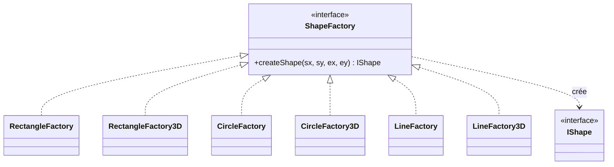

> **Remarque de validation** : la sélection de la fabrique concrète se fait
> dans `ToolPalette.updateFactory()` selon le type choisi et le bouton 2D/3D.
> C'est donc un Factory Method « paramétré » (proche d'une *Simple Factory*),
> mais chaque ConcreteCreator redéfinit bien la méthode-fabrique `createShape` :
> la démonstration du patron reste valide.

---

### 3.2 Observer (Observateur)

**Ce qu'il fait** — Découple l'émetteur d'un changement de ses réactions. Quand
l'utilisateur sélectionne un outil dans la `ToolPalette`, celle-ci notifie ses
observateurs ; le `DrawingCanvas` se redessine sans que la palette ne le connaisse
directement.

**Pourquoi ici** — La palette et le canevas évoluent indépendamment ; l'Observer
évite un couplage fort palette→canevas et permet d'ajouter d'autres observateurs
(p. ex. une barre de statut) sans modifier la palette.

**Classes** — `IObservable` (Subject), `IObserver` (Observer), `ToolPalette`
et toutes les formes `IShape` sont *observables* ; `DrawingCanvas` est
l'*observateur* concret (`update()` → `redraw()`).

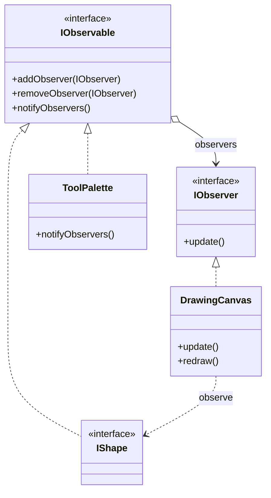

---

### 3.3 Command (Commande) + Undo/Redo

**Ce qu'il fait** — Encapsule chaque action utilisateur (dessiner, gommer,
redimensionner) dans un objet `ICommand` possédant `execute()` et `undo()`. Le
`CommandManager` empile les commandes exécutées (pile *undo*) et les commandes
annulées (pile *redo*).

**Pourquoi ici** — C'est le patron canonique pour un Undo/Redo robuste : chaque
commande sait défaire son propre effet et capture l'état nécessaire à
l'annulation (ex. `ResizeShapeCommand` mémorise l'extrémité précédente).

**Classes** — `ICommand`, `CommandManager` (Invoker), `AddShapeCommand`,
`EraseShapeCommand`, `ResizeShapeCommand` ; le `DrawingCanvas` est le *Receiver*.

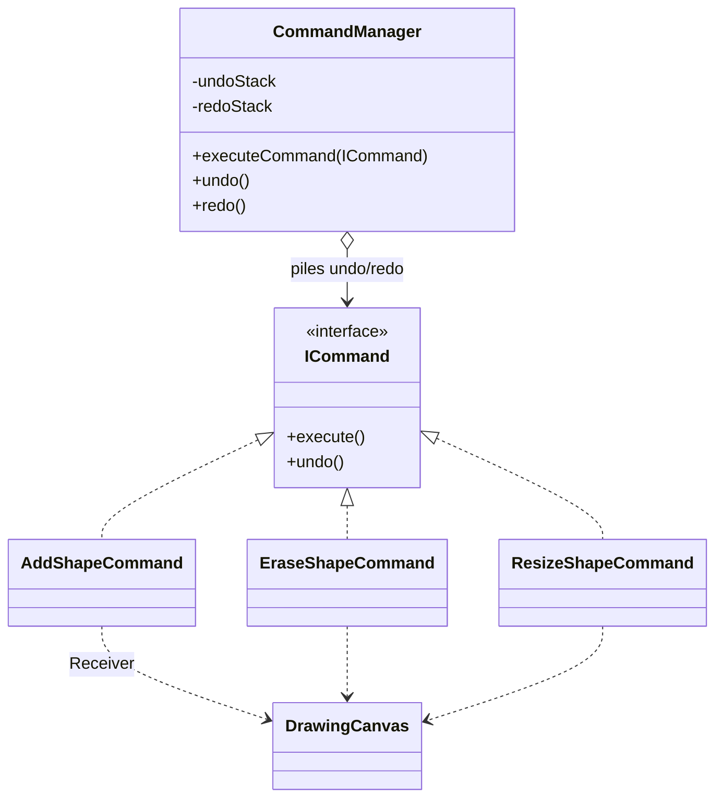

---

### 3.4 Decorator (Décorateur)

**Ce qu'il fait** — Ajoute dynamiquement des responsabilités visuelles à une
forme sans modifier sa classe : remplissage (`FillColorDecorator`) et contour
(`BorderColorDecorator`). Les décorateurs s'empilent
(`BorderColorDecorator(FillColorDecorator(shape))`).

**Pourquoi ici** — Les combinaisons (remplir / border / les deux / aucun) sont
nombreuses ; une hiérarchie d'héritage exploserait. Le Decorator compose les
effets à l'exécution selon les cases cochées dans la palette.

**Contrat de rendu (refactorisé — voir §4)** : `IShape.draw()` ne dessine
**rien** par défaut. Chaque forme implémente `fillShape()` (intérieur) et
`strokeShape()` (contour). `FillColorDecorator.draw()` = remplissage seul ;
`BorderColorDecorator.draw()` = contenu encapsulé **puis** contour.

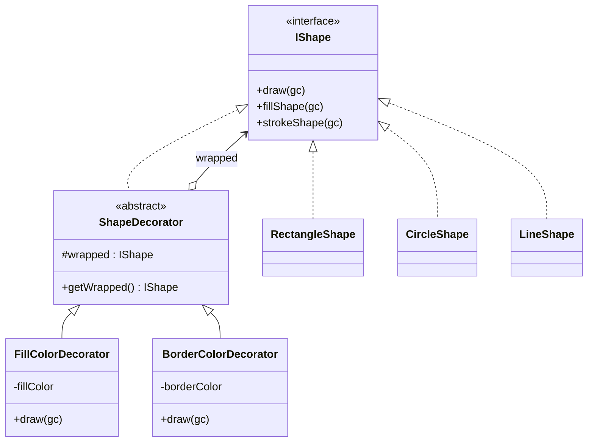

---

### 3.5 Strategy (Stratégie) — journalisation

**Ce qu'il fait** — Rend l'algorithme de journalisation interchangeable à
l'exécution : console (`LogConsole`), fichier (`LogFile`) ou base
(`LogDB`). Le contexte `Logger` délègue à la stratégie courante.

**Pourquoi ici** — La destination des logs est une variation pure de
comportement ; Strategy permet de la changer via un `ComboBox` sans
conditionnelle `if/switch` disséminée dans le code.

**Classes** — `ILogger` (Strategy), `LogConsole` / `LogFile` / `LogDB`
(ConcreteStrategies), `Logger` (Context, voir §3.6).

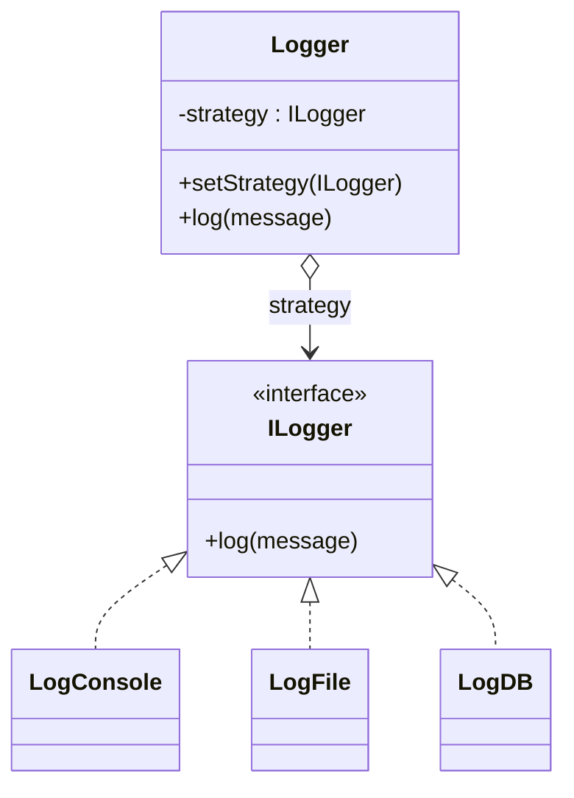

---

### 3.6 Singleton

**Ce qu'il fait** — Garantit une instance unique partagée.
- `Logger` : un seul journal pour toute l'application (et porte la Strategy de §3.5).
- `DatabaseConnection` : une seule connexion JDBC partagée par `LogDB` **et**
  `DrawingRepository`.

**Pourquoi ici** — Le journal et la connexion BD sont des ressources globales :
on veut un point d'accès unique, une configuration centralisée, et éviter
d'ouvrir plusieurs connexions PostgreSQL.

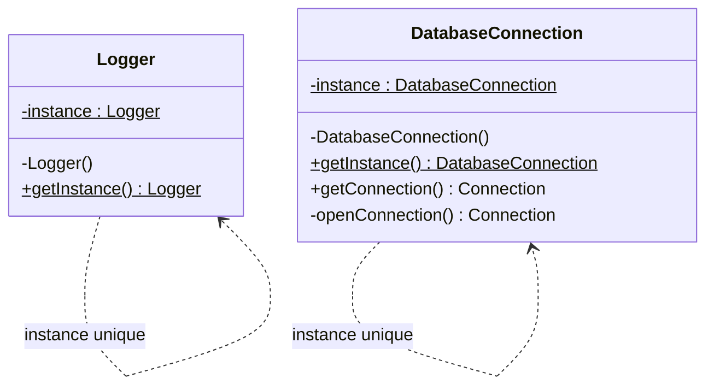

> **Validation** : initialisation paresseuse non *thread-safe*
> (`if (instance == null)`). Acceptable ici car tous les accès passent par
> l'unique thread JavaFX (*Application Thread*) ; à signaler dans un contexte
> multi-thread (utiliser *holder idiom* ou `synchronized`).

---

### 3.7 Strategy — plus court chemin (étude de cas)

**Ce qu'il fait** — Même patron que la journalisation, appliqué au calcul du
plus court chemin : `Dijkstra`, `Bellman-Ford` ou `BFS`, choisis dans un
`ComboBox`. Le contexte `PathCalculator` délègue à la stratégie courante.

**Modèle de graphe** — `GraphBuilder` transforme les formes en `Graph` :
toute forme **non-ligne** = un nœud (sur son centre), chaque **ligne** = une
arête (poids = distance euclidienne). *Repli* : si aucune ligne ne crée
d'arête, le graphe est rendu **complet** afin qu'une distance soit toujours
calculable.

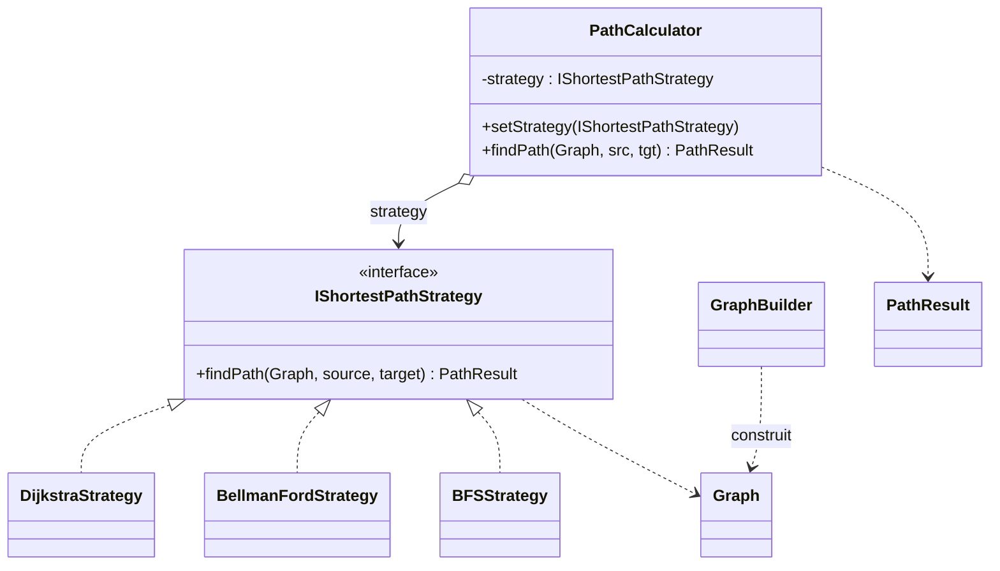

---

### 3.8 DAO / Repository — persistance

**Ce qu'il fait** — `DrawingRepository` est un *Data Access Object* : il
isole la logique SQL (PostgreSQL) du reste de l'application. Il gère
**plusieurs dessins nommés** :

- `listDrawings()` — noms des dessins enregistrés ;
- `save(nom, formes)` — crée/écrase le dessin nommé (transaction) ;
- `load(nom)` — reconstruit les formes via **Factory** + **Decorator**.

**Pourquoi ici** — Centraliser l'accès aux données, garder le SQL hors de
l'IHM, et illustrer la collaboration entre patrons : la reconstruction d'un
dessin réutilise les fabriques et ré-empile les décorateurs de couleur.

**Schéma** : `drawings(id, name UNIQUE, created_at)` et
`shapes(id, drawing_id, kind, is3d, x1,y1,x2,y2, fill_color, border_color)`.

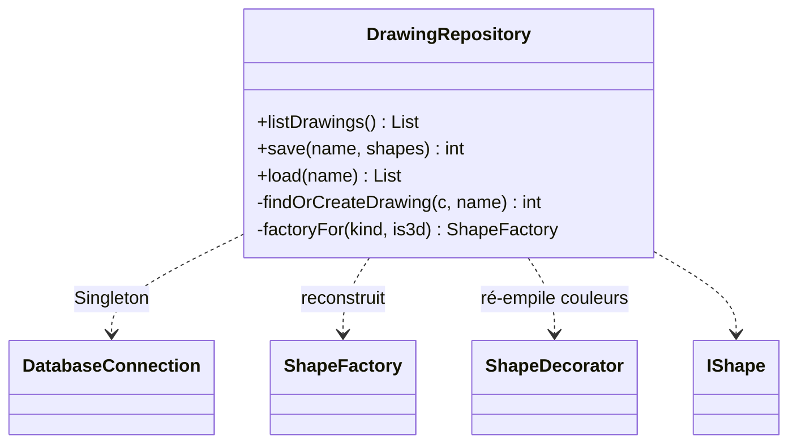

---

## 4. Choix de conception (décisions)

Décisions structurantes prises (ou confirmées) au cours du développement, avec
leur justification.

### D1 — Redimensionnement = Command, **pas** Decorator
Le redimensionnement est une **action annulable** → c'est exactement le rôle du
patron **Command** (`ResizeShapeCommand`, intégré aux piles undo/redo). Un
`ResizeDecorator` aurait été sémantiquement faux (un Decorator *ajoute une
responsabilité visuelle*, il ne *mute pas la géométrie*) et aurait cassé : (a)
l'undo/redo, (b) le parcours de chaîne de décorateurs de la persistance
(`findFill`/`findBorder`), (c) la composition (empiler deux resize n'a pas de
sens). **Décision : conserver Command.**

### D2 — Refactorisation du contrat de rendu Decorator
*Problème initial* : chaque forme dessinait elle-même son contour dans `draw()`,
et `DrawingCanvas` posait un trait noir par défaut. Décocher « Bordure » ne
supprimait donc pas le contour (il restait, en noir).
*Solution* : `IShape.draw()` devient **no-op** par défaut ; on sépare
`fillShape()` (intérieur) et `strokeShape()` (contour). `FillColorDecorator`
ne fait que remplir, `BorderColorDecorator` ne fait que tracer le contour.
*Conséquence assumée* : une forme **sans remplissage ni bordure est invisible**
(c'est l'absence volontaire de tout rendu). C'est le modèle Decorator *correct*.

### D3 — Persistance multi-dessins
Passage d'un dessin unique global à des **dessins nommés** (tables `drawings` +
`shapes`, FK logique `drawing_id`). Migration douce d'une ancienne base via
`ALTER TABLE shapes ADD COLUMN IF NOT EXISTS drawing_id`. IHM : `TextInputDialog`
(nom à l'enregistrement, un nom existant écrase) et `ChoiceDialog` (sélection à
l'ouverture). `ToolPalette` inchangée (callbacks `Runnable`, la logique des
boîtes de dialogue vit dans `HelloFX`).

### D4 — Auto-création de la base
La connexion échouait car la base `logdb` n'existait pas (SQLState `3D000`).
`DatabaseConnection.openConnection()` détecte ce cas, se connecte à la base de
maintenance `postgres`, exécute `CREATE DATABASE logdb`, puis se reconnecte.
Identifiants : `postgres` / `admin` (en clair — acceptable pour un projet
pédagogique, à signaler).

### D5 — Couleur de ligne et bordure non forcée
Une ligne n'a pas d'intérieur : sa **couleur = le sélecteur principal
« Couleur »** (et non l'ancien sélecteur de bordure). La bordure des formes
fermées n'est appliquée **que si la case « Bordure » est cochée** (suppression
du `|| isLine` qui la forçait).

### D6 — IHM réorganisée (visuel uniquement)
Barre d'outils regroupée en sections étiquetées compactes (`FlowPane`), boutons
stylés avec survol (accent primaire pour *Plus court chemin / Enregistrer /
Ouvrir*), fond du canevas **blanc** (au lieu de jaune). Aucune logique, aucun
*callback*, aucune API publique modifiés.

---

## 5. Conception UML — diagramme de classes

Vue d'ensemble (simplifiée — relations principales entre patrons) :

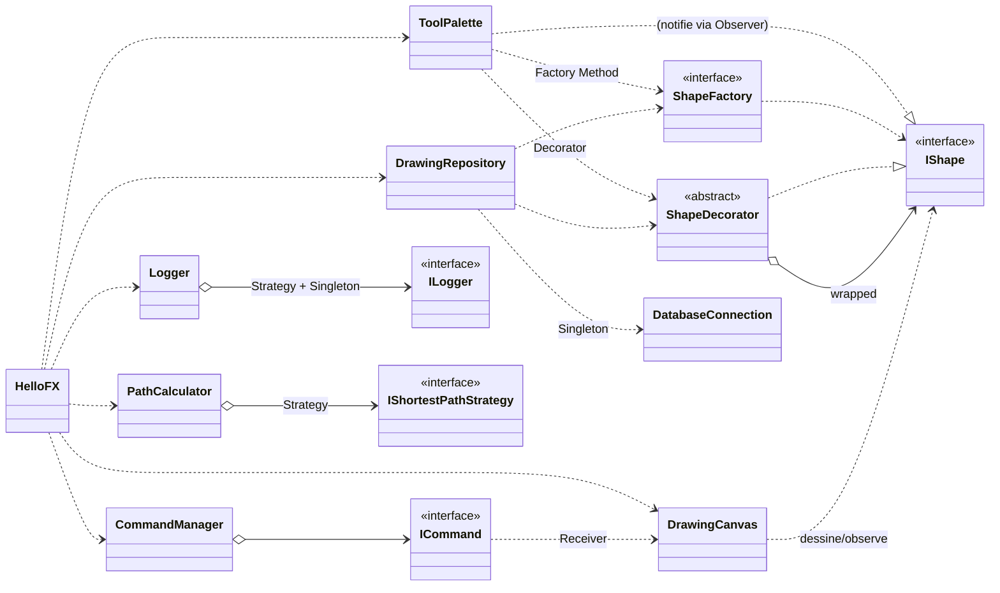

Les diagrammes détaillés par patron figurent en §3.

---

## 6. Diagrammes de séquence

### 6.1 Dessiner une forme (Factory + Decorator + Command + Observer)

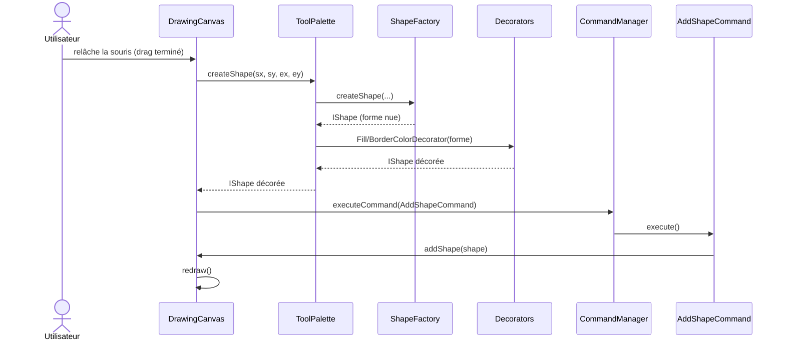

### 6.2 Changer la stratégie de journalisation (Strategy + Singleton)

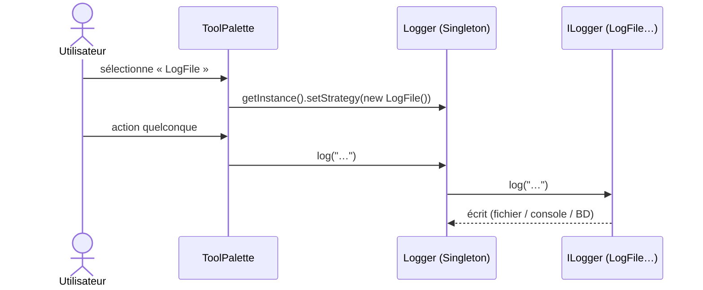

### 6.3 Calcul du plus court chemin (Strategy)

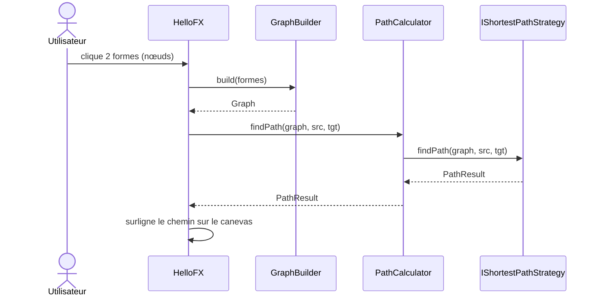

---

## 7. Validation & remarques

**Patrons — conformité** : les 6 patrons GoF requis (Factory Method, Observer,
Command, Decorator, Strategy, Singleton) sont présents, correctement structurés
et réellement utilisés par l'IHM. L'étude de cas (plus court chemin) réutilise
Strategy de façon cohérente avec la journalisation. La persistance illustre la
collaboration Factory + Decorator + Singleton.

**Points d'amélioration relevés (non bloquants)** :

1. `dp.DS.observer.Shape` est une **interface vide et non utilisée** → code
   mort, à supprimer.
2. Le package **`dp.DS.Factory`** a une majuscule, contrairement à la
   convention Java (packages en minuscules) et aux autres packages du projet.
3. Le package `observer` regroupe beaucoup de responsabilités (formes,
   canevas, palette, interfaces Observer). Cohésion perfectible — on pourrait
   séparer `shape` / `ui` / `observer` — mais acceptable pour le périmètre.
4. Singletons à initialisation paresseuse **non thread-safe** (cf. §3.6).
5. Identifiants PostgreSQL **en clair** dans `DatabaseConnection` (projet
   pédagogique — à externaliser dans une vraie application).
6. Commentaire de `Graph` légèrement obsolète (« chaque cercle = un nœud »
   alors que `GraphBuilder` prend toute forme non-ligne).
7. La couleur d'une ligne est stockée dans la colonne `border_color` (détail
   d'implémentation : visuellement correct car la ligne est un *stroke*).

**Conclusion** : structure saine, patrons bien démontrés et justifiés ; les
remarques ci-dessus sont des finitions, pas des défauts de conception.

---

## 8. Compilation & exécution

**Prérequis** : JDK 17, JavaFX SDK 21 (`C:\javafx-sdk-21.0.10\lib`),
PostgreSQL en écoute sur `localhost:5432` (utilisateur `postgres`, mot de
passe `admin` — la base `logdb` est créée automatiquement si absente),
pilote `lib\postgresql-42.7.3.jar`.

**Compilation** (sans Maven/Gradle) :

```bat
javac -d out --module-path C:\javafx-sdk-21.0.10\lib ^
  --add-modules javafx.controls,javafx.graphics,javafx.base ^
  -cp lib\postgresql-42.7.3.jar <tous les .java de src>
```

**Exécution** (utiliser le **java de JDK 17**, pas un éventuel Java 8 du PATH) :

```bat
"C:\Program Files\Java\jdk-17\bin\java.exe" ^
  --module-path C:\javafx-sdk-21.0.10\lib ^
  --add-modules javafx.controls,javafx.fxml ^
  -cp "out;lib\postgresql-42.7.3.jar" dp.main.HelloFX
```

Sous IntelliJ, le pilote PostgreSQL est déclaré comme dépendance de module
dans `miniprojet.iml` ; en cas d'erreur « Driver PostgreSQL introuvable »,
recharger le projet (*Reload All from Disk*).
